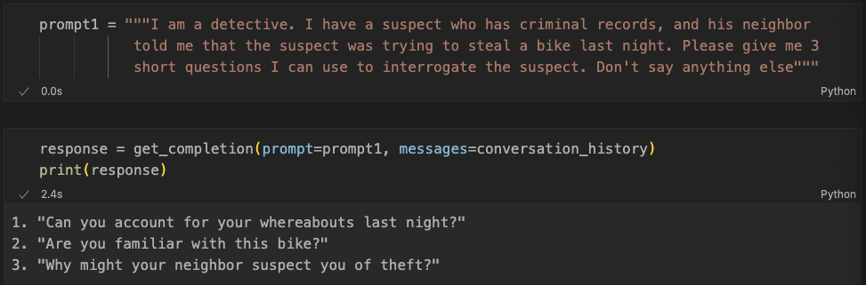

# MyDetective

## Overview
Welcome to MyDetective, an innovative project presented at natHacks 2023! Designed to revolutionize security interviews, such as suspect interrogations in police investigations, our program integrates advanced AI technologies to assist interviewers. This README provides a comprehensive overview of the program's flow, technology rationale, relevance, and our team's roles.

## Program Flow and Technology Rationale
Our program harnesses various AI technologies, each chosen for its specific capabilities:

1. **Question Generation with GPT-4**:
   - Background information of the interviewee is inputted into OpenAI's GPT-4.
   - **Why GPT-4?**: GPT-4's advanced language understanding generates contextually relevant and strategic questions, providing interviewers with tailored queries based on the interviewee's background.

2. **Data Analysis During Interview**:
   - **Facial Expression Analysis with DeepFace API**: Analyzes interviewee's facial expressions to identify emotions.

   - **Speech Recognition and Analysis**: Google's speech recognition API transcribes responses. The `MoritzLaurer/DeBerta-v3-base-mnli-fever-anli` model classifies the speech into emotions.
   - **EEG Data Analysis**: A random forest model analyzes EEG data to determine whether the interviewee is lying or not. Brainflow library connects the EEG machine to the computer.
   - **Why These Technologies?**: They enable a comprehensive analysis of the interviewee's responses, capturing verbal, emotional, and physiological reactions to reveal nuances and discrepancies.

3. **Dynamic Questioning with GPT-4**:
   - Integrates transcription, emotional data from facial expressions, NLP analysis, and EEG data.
   - GPT-4 suggests the next question, dynamically adapting to the interviewee's state.

4. **Iterative Process**:
   - Repeats steps 2 and 3 for a thorough, adaptive interview.

## Significance of Multi-Dimensional Analysis
- **Facial Expression Analysis**: Immediate emotional indicators providing insights into involuntary emotional responses.
- **Speech Analysis (NLP Zero-Shot-Classification)**: Uncovers underlying emotions within the spoken content, offering a deeper understanding beyond literal words.
- **EEG Analysis**: Trained to classify if a person is lying, providing a direct assessment of truthfulness, a critical factor in security interviews.

## Relevance of the Project
- **Accuracy**: Detecting lies or stress is vital in ascertaining truth in critical situations like criminal investigations.
- **Efficiency**: Quickly identifying key emotional responses guides interviewers to focus on pertinent areas.
- **Psychological Insights**: Provides deeper insights into motives or hidden feelings.

## Technologies Used
- **Python**: Primarily for data science tasks.
- **React.js**: For the web interface.
- **Socket.IO and Amazon EC2**: For real-time communication and robust server infrastructure.

## Front-end and Data Visualization
- Visualizes emotional states and brainwave data in real-time, enhancing interviewer understanding and decision-making.

## Communication and Server Setup
- Ensures dynamic, secure, and efficient data handling and communication between applications.

## Team and Roles
- **Joshua Tablan**: Hardware Specialist
- **Dohyun Kim**: Full Stack Developer
- **Yongbin Kim**: Frontend Developer
- **Minjae Jeong**: Backend Developer
- **Jamie Lee**: Data Scientist
- **Taekwan Yoon**: Data Scientist

---

MyDetective is a testament to the power of AI in enhancing critical processes like security interviews. Our integration of advanced technologies aims to improve accuracy, efficiency, and depth in investigative interviews.
